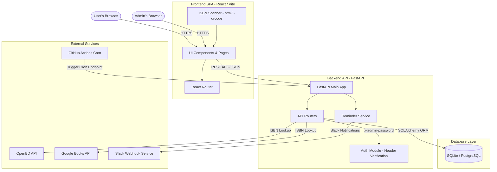
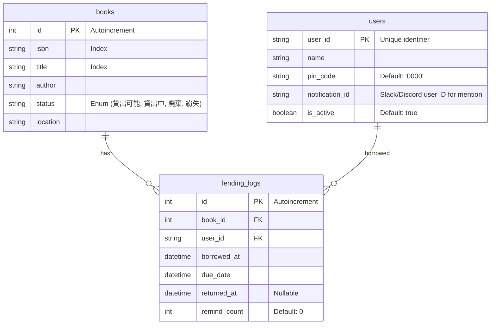

# QUSIS Library - System Architecture Document

This document outlines the system architecture, technologies, data flow, and database schema for the **QUSIS Library** system, a lightweight and responsive book management application.

---

## 1. Architectural Overview

The application follows a decoupled **Client-Server Architecture** with a single-page frontend application, a RESTful API backend, a relational database, and an automated background notification service.

---

## 2. Component Layout & Technology Stack

### 2.1 Frontend (`/frontend`)
*   **Core Framework**: React (built with Vite)
*   **Styling**: Tailwind CSS & Vanilla CSS (combining glassmorphic UI styles)
*   **Routing**: React Router (`react-router-dom`)
*   **Icons**: Lucide React
*   **Key Dependencies**: `html5-qrcode` (restricted to EAN-13 format for optimal camera barcode scanning speeds)
*   **Deployment**: Vercel

### 2.2 Backend (`/backend`)
*   **Framework**: FastAPI (Python 3.11)
*   **ASGI Server**: Uvicorn / Gunicorn
*   **ORM**: SQLAlchemy
*   **External Requests**: `requests` (used to query OpenBD and Google Books API for auto-populating book metadata from ISBN scans)
*   **Deployment**: Render

### 2.3 Database Layer
*   **Development / Local**: SQLite (`books.db`)
*   **Production**: PostgreSQL (Supabase or Render PostgreSQL instance)
*   **Migration**: [migrate_data.py](file:///c:/Users/njaii/OneDrive/Apps/%E8%94%B5%E6%9B%B8%E7%AE%A1%E7%90%86%E3%82%A2%E3%83%97%E3%83%AA/migrate_data.py) transfers database schemas and contents from SQLite to PostgreSQL and synchronizes serial auto-increment sequences.

### 2.4 Automation & Integration
*   **Daily Cron Job**: GitHub Actions workflow [reminder-cron.yml](file:///c:/Users/njaii/OneDrive/Apps/%E8%94%B5%E6%9B%B8%E7%AE%A1%E7%90%86%E3%82%A2%E3%83%97%E3%83%AA/.github/workflows/reminder-cron.yml) triggered daily at `10:00 JST` (`01:00 UTC`). It sends an authorized HTTPS request to the backend cron endpoint.
*   **Notifications**: The backend verifies the `X-Cron-Secret` header and pushes reminder messages (due soon, today's due, and overdue alerts) via Slack webhook.

---

## 3. Database Schema

The system uses three tables mapping books, users, and lending history logs.

---

## 4. API Endpoints

### 4.1 Books Route (`/books`)
*   `GET /books/`: Search and fetch book collection (paginated).
*   `POST /books/`: Create a new book. If `title` is missing, the backend fetches book metadata automatically using the ISBN with OpenBD and Google Books APIs. (Requires admin header authentication).
*   `GET /books/{isbn}`: Get book details by ISBN.
*   `PUT /books/{book_id}`: Update book information. (Requires admin header authentication).
*   `DELETE /books/{book_id}`: Delete a book. Fails if the book status is currently "LENT". (Requires admin header authentication).

### 4.2 Users Route (`/users`)
*   `GET /users/`: Retrieve all users list. (Requires admin header authentication).
*   `POST /users/`: Create a single new user. (Requires admin header authentication).
*   `POST /users/bulk`: Upload/register multiple users at once. Updates records if the user ID already exists. (Requires admin header authentication).
*   `DELETE /users/bulk-delete`: Delete multiple users. Users with active lending logs are skipped. (Requires admin header authentication).
*   `GET /users/{user_id}`: Fetch user metadata. (Requires admin header authentication).
*   `GET /users/{user_id}/lending-logs`: View all active and historic logs for a specific user, verified using user PIN code.

### 4.3 Lending Route (`/lending`)
*   `GET /lending/active`: Returns all books currently lent out with overdue indicators. (Requires admin header authentication).
*   `POST /lending/lend`: Borrow a book. Validates user status, PIN code, and updates book status to "LENT".
*   `POST /lending/return`: Return a book. Accepts `isbn` or `book_id` and registers `returned_at` in the lending log, changing the book status back to "AVAILABLE".

### 4.4 Cron Route (`/api/cron`)
*   `GET /api/cron/check-overdue`: Triggered via GitHub actions to check for overdue items and dispatch Slack webhook alerts. Security is enforced using the `X-Cron-Secret` header validation.

---

## 5. Security & Authorization

1.  **Admin Auth**: Simple, stateless custom header auth. Admin actions require the HTTP request header `X-Admin-Password` to match the backend environment variable `ADMIN_PASSWORD`.
2.  **User Verification**: Borrowing a book or viewing user-specific loan history requires submitting a 4-digit `pin_code` stored securely in the `User` table, preventing unauthorized transactions on shared kiosk devices.
3.  **Cron Endpoint Security**: The cron endpoint requires an `X-Cron-Secret` header matching the `CRON_SECRET` environment variable to prevent arbitrary request spamming.
