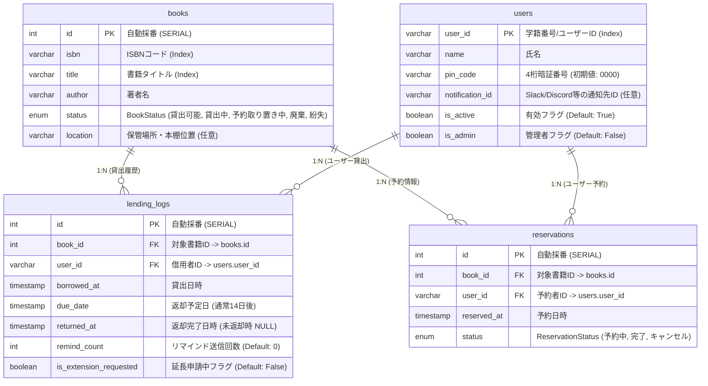
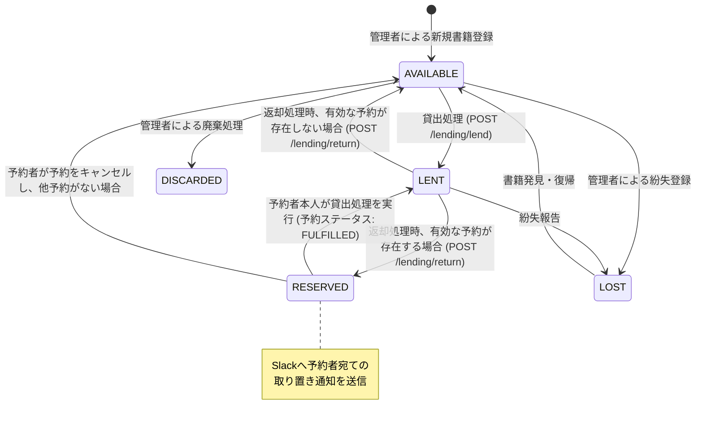
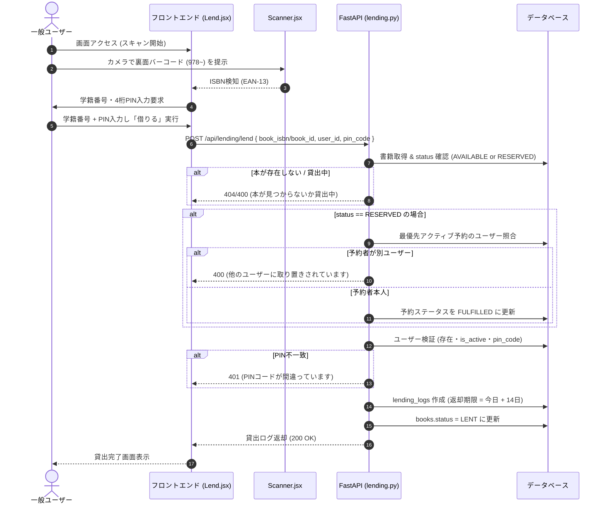
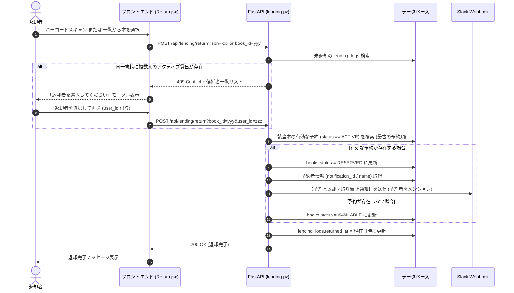
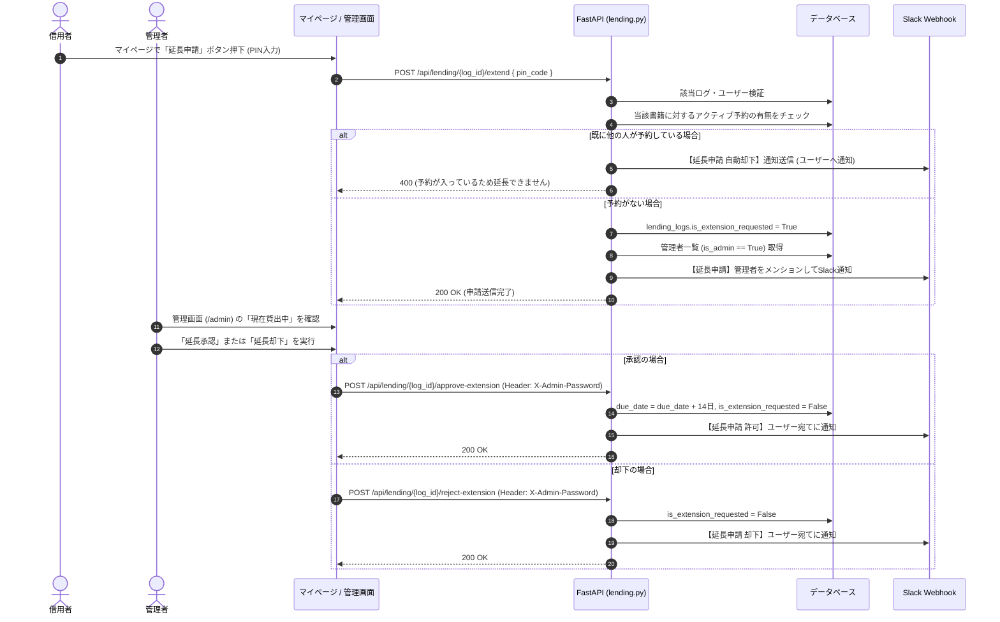
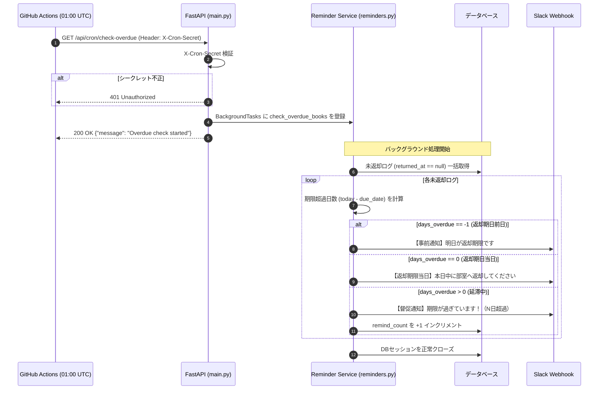

# QUSIS 蔵書管理システム 詳細アーキテクチャ設計書 (System Architecture Document)

本ドキュメントは、コードベース全体のリバースエンジニアリング（ソースコード、データベース定義、ルーティング、設定ファイル、CI/CDワークフローの静的解析および振る舞い分析）に基づき、**QUSIS 蔵書管理システム（QUSIS Library）**の全体構造、技術スタック、データモデル、ビジネスロジック、状態遷移、シーケンス、API仕様、セキュリティモデル、運用構成を詳細に定義・文書化したものです。

---

## 1. システム全体概要 (System Overview)

本システムは、部室・研究室等の図書を効率的に管理・貸出・返却・予約・督促するためのWebアプリケーションです。
カメラを用いたISBNバーコード（EAN-13）の高速スキャン機能、書誌情報自動取得（OpenBD / Google Books）、Slackと連携したリアルタイム通知および自動延滞督促バッチを備えた**クライアント・サーバー型SPAアーキテクチャ**を採用しています。

### システムコンテキスト & レイヤー構成図

```mermaid
graph TB
    %% アクター
    User([一般ユーザー / 学生])
    Admin([図書管理者])
    CronRunner([GitHub Actions Cron])

    %% フロントエンド
    subgraph FrontendLayer [フロントエンド層 (Vercel / SPA)]
        direction TB
        ReactApp["React 19 + Vite SPA"]
        Router["React Router v7"]
        ScannerComp["Scanner (html5-qrcode EAN-13)"]
        Pages["UI Pages (Home / Lend / Return / Reserve / MyPage / Admin)"]
        ApiModule["API Client (api.js / fetch)"]

        ReactApp --> Router
        Router --> Pages
        Pages --> ScannerComp
        Pages --> ApiModule
    end

    %% バックエンド
    subgraph BackendLayer [バックエンド層 (Render / ASGI)]
        direction TB
        FastAPIApp["FastAPI App (ASGI)"]
        CorsMiddleware["CORS Middleware"]
        AuthModule["Auth Module (X-Admin-Password 検証)"]
        
        subgraph Routers [API Routers]
            BooksRouter["/books (書籍管理・検索)"]
            UsersRouter["/users (ユーザー・PIN管理)"]
            LendingRouter["/lending (貸出・返却・延長)"]
            ResRouter["/reservations (予約管理)"]
            CronEndpoint["/api/cron (延滞チェック)"]
        end

        subgraph Services [Service Layer]
            Reminders["Reminder Service (Slack通知・督促判定)"]
        end

        FastAPIApp --> CorsMiddleware
        FastAPIApp --> Routers
        Routers --> AuthModule
        CronEndpoint --> Reminders
    end

    %% データストア
    subgraph DataLayer [データ永続化層]
        SQLAlchemyORM["SQLAlchemy ORM (SessionLocal)"]
        SQLiteDB[("開発環境: SQLite (books.db)")]
        PostgresDB[("本番環境: PostgreSQL (Supabase / Render) + RLS")]
    end

    %% 外部API・サービス
    subgraph ExternalServices [外部連携サービス]
        OpenBD["OpenBD API (書籍メタデータ取得)"]
        GoogleBooks["Google Books API (フォールバック検索)"]
        SlackWebhook["Slack Incoming Webhook (通知・督促)"]
    end

    %% 接続関係
    User -->|HTTPS| ReactApp
    Admin -->|HTTPS| ReactApp
    CronRunner -->|UTC 01:00 日次トリガー (X-Cron-Secret)| CronEndpoint

    ApiModule -->|REST API (JSON)| FastAPIApp
    Routers --> SQLAlchemyORM
    SQLAlchemyORM --> SQLiteDB
    SQLAlchemyORM --> PostgresDB

    BooksRouter -->|ISBN検索| OpenBD
    BooksRouter -->|フォールバックISBN検索| GoogleBooks
    LendingRouter -->|返却時・延長申請・承認時通知| SlackWebhook
    Reminders -->|前日/当日/延滞リマインダー| SlackWebhook
```

---

## 2. 技術スタック一覧 (Technology Stack)

| レイヤー | カテゴリ | 採用技術・ライブラリ | バージョン / 備考 |
| :--- | :--- | :--- | :--- |
| **Frontend** | ライブラリ / フレームワーク | React, React DOM | `^19.2.5` |
| | ビルドツール / バンドラ | Vite | `^8.0.10` |
| | ルーティング | React Router (`react-router-dom`) | `^7.15.0` |
| | スタイリング | Tailwind CSS, `@tailwindcss/vite`, Vanilla CSS | `^4.3.0` (グラスモフィズムデザイン) |
| | バーコードスキャン | `html5-qrcode` | `^2.3.8` (EAN-13 / 978~限定スキャン) |
| | アイコン | `lucide-react` | `^1.14.0` |
| | デプロイ先 | Vercel | SPAリダイレクト設定 (`vercel.json`) |
| **Backend** | 言語 / ランタイム | Python | 3.11.0 |
| | Webフレームワーク | FastAPI | 高速ASGIフレームワーク |
| | ASGIサーバー | Uvicorn | 本番起動: `uvicorn backend.main:app` |
| | ORM / DBアクセス | SQLAlchemy | ORMモデル + セッション管理 |
| | バリデーション | Pydantic v2 | `model_dump()`, `from_attributes = True` |
| | HTTPクライアント | `requests` | 外部API呼び出し用 |
| | デプロイ先 | Render | Webサービス (無料枠) + `render.yaml` |
| **Database** | 開発環境 | SQLite | `books.db` |
| | 本番環境 | PostgreSQL (Supabase / Render) | RLS (Row-Level Security) 適用済み |
| | データ移行・同期 | 自作移行スクリプト | `migrate_data.py`, `enable_rls.py` |
| **External / CI**| 外部書籍API | OpenBD API / Google Books API | 書影・書名・著者自動補完 |
| | チャット通知 | Slack Incoming Webhook | 延長申請、取り置き通知、延滞督促 |
| | 定期自動実行 | GitHub Actions (`schedule`) | 毎日 01:00 UTC (日本時間 10:00) |

---

## 3. ディレクトリ構成 (Directory Structure)

```
蔵書管理アプリ/
├── .github/
│   └── workflows/
│       └── reminder-cron.yml     # 日次延滞・督促通知用GitHub Actions
├── backend/
│   ├── __init__.py
│   ├── auth.py                  # X-Admin-Password 検証依存関数
│   ├── database.py              # DB接続エンジン・セッション定義
│   ├── main.py                  # FastAPIエントリポイント, CORS, 例外ハンドラ
│   ├── models.py                # SQLAlchemy ORMモデル定義
│   ├── requirements.txt         # バックエンド依存パッケージ一覧
│   ├── schemas.py               # Pydanticスキーマ定義
│   ├── routers/
│   │   ├── __init__.py
│   │   ├── books.py             # 書籍CRUD・ISBN外部取得
│   │   ├── lending.py           # 貸出・返却・延長申請/承認/却下
│   │   ├── reservations.py      # 書籍予約・予約キャンセル・予約一覧
│   │   └── users.py             # ユーザーCRUD・CSV一括登録・PIN検証/変更
│   └── services/
│       ├── __init__.py
│       └── reminders.py         # 延滞判定・Slack Webhook送信サービス
├── frontend/
│   ├── index.html
│   ├── package.json
│   ├── vercel.json              # SPAルーティングリライト設定
│   ├── vite.config.js
│   └── src/
│       ├── App.css
│       ├── App.jsx              # ルーティング設定・共通ヘッダー/フッター
│       ├── api.js               # APIベースURL・パス解決ヘルパー
│       ├── index.css            # グローバルスタイル・グラスモーフィズム
│       ├── main.jsx
│       ├── components/
│       │   └── Scanner.jsx      # カメラバーコードスキャンコンポーネント
│       └── pages/
│           ├── Admin.jsx        # 管理者ダッシュボード (書籍/利用者/貸出/予約/履歴)
│           ├── Home.jsx         # トップページ・書籍一覧/インクリメンタル検索
│           ├── Lend.jsx         # 貸出フロー画面 (スキャン/手動/PIN入力)
│           ├── Return.jsx       # 返却フロー画面 (競合返却者選択対応)
│           ├── Reserve.jsx      # 予約登録フロー画面
│           └── MyPage.jsx       # 利用者マイページ (現在貸出/予約/延長申請/PIN変更)
├── books.db                     # 開発用SQLiteデータベース
├── enable_rls.py                # Supabaseテーブル向けRLS一括有効化スクリプト
├── migrate_data.py              # SQLite → PostgreSQL データ移行・シーケンス同期
├── render.yaml                  # Renderデプロイ定義ファイル
└── ARCHITECTURE.md              # 本アーキテクチャ設計書
```

---

## 4. データモデル & ER図 (Database Design)

システムは4つの主要エンティティ（`books`, `users`, `lending_logs`, `reservations`）および2つのEnum型で構成されます。

### 4.1 ERダイアグラム



### 4.2 列挙型 (Enum Definitions)

#### `BookStatus`
*   `AVAILABLE` ("貸出可能"): 誰でも貸出可能な状態。
*   `LENT` ("貸出中"): 貸出中の状態。他のユーザーは予約可能。
*   `RESERVED` ("予約取り置き中"): 返却されたが予約者が存在するため、予約者専用に取り置かれている状態。
*   `DISCARDED` ("廃棄"): 除籍・廃棄済みの状態。
*   `LOST` ("紛失"): 行方不明・紛失状態。

#### `ReservationStatus`
*   `ACTIVE` ("予約中"): 貸出中または取り置き中で、貸出処理待ちの状態。
*   `FULFILLED` ("完了"): 予約者が対象本を貸出完了した状態。
*   `CANCELLED` ("キャンセル"): 予約者または管理者が予約を取り消した状態。

---

## 5. 書籍ライフサイクル & 状態遷移 (State Machine)

書籍の状態（`BookStatus`）は、貸出、返却、予約、延長申請の各イベントにより以下のように遷移します。



---

## 6. 主要業務フロー & シーケンス (Sequence Diagrams)

### 6.1 貸出フロー (Lending Flow)



### 6.2 返却フロー & 予約取り置き通知 (Return & Reservation Notification Flow)



### 6.3 延長申請 & 管理者承認フロー (Extension Request & Approval Flow)



### 6.4 日次自動延滞督促バッチ (Daily Overdue Cron Flow)



---

## 7. REST API エンドポイント詳細仕様書 (API Specifications)

### 認証方式
1.  **管理者認証**: HTTPヘッダー `X-Admin-Password` にサーバー環境変数 `ADMIN_PASSWORD` を指定。
2.  **利用者認証**: 学籍番号（`user_id`）+ 4桁数字（`pin_code`）。
3.  **Cron認証**: HTTPヘッダー `X-Cron-Secret` にサーバー環境変数 `CRON_SECRET` を指定。

---

### 7.1 書籍管理 (`/books`)

| メソッド | パス | 認証 | 概要 | リクエスト/クエリ | レスポンス |
| :--- | :--- | :--- | :--- | :--- | :--- |
| `GET` | `/books/` | 不要 | 書籍一覧取得（ページネーション・検索・予約数集計） | `skip`, `limit`, `search` | `List[Book]` (各書籍に `reservation_count` 付与) |
| `POST` | `/books/` | 管理者 | 新規書籍登録（title空時はOpenBD/GoogleBooksからISBN自動解決） | `BookCreate` (JSON) | `Book` |
| `GET` | `/books/{isbn}` | 不要 | ISBNによる書籍詳細取得 | パスパラメータ `isbn` | `Book` |
| `PUT` | `/books/{book_id}` | 管理者 | 書籍情報更新（タイトル、著者、ステータス、保管場所） | `BookUpdate` (JSON) | `Book` |
| `DELETE` | `/books/{book_id}` | 管理者 | 書籍削除（貸出中の書籍は削除不可） | パスパラメータ `book_id` | `{"detail": "Book deleted successfully"}` |

---

### 7.2 ユーザー管理 (`/users`)

| メソッド | パス | 認証 | 概要 | リクエスト/クエリ | レスポンス |
| :--- | :--- | :--- | :--- | :--- | :--- |
| `GET` | `/users/` | 管理者 | 全ユーザー一覧取得 | `skip`, `limit` | `List[User]` |
| `POST` | `/users/` | 管理者 | ユーザー個別登録 | `UserCreate` (JSON) | `User` |
| `POST` | `/users/bulk` | 管理者 | CSV等からの一括登録/更新（差分更新対応） | `List[UserCreate]` (JSON) | `{"detail": "...", "added": N, "updated": M}` |
| `DELETE` | `/users/bulk-delete` | 管理者 | ユーザー一括削除（未返却本があるユーザーはスキップ） | `List[str]` (user_id 配列) | `{"detail": "...", "deleted": N, "skipped": [...]}` |
| `GET` | `/users/{user_id}` | 管理者 | ユーザー詳細取得 | パスパラメータ `user_id` | `User` |
| `GET` | `/users/{user_id}/lending-logs` | PIN検証 | ユーザー個別貸出履歴取得（マイページ用） | クエリ `pin_code` | `List[LendingLog]` |
| `POST` | `/users/{user_id}/verify-pin` | 不要 | PINコードの正当性検証 | `PinVerify` (`{pin_code}`) | `{"status": "ok"}` |
| `POST` | `/users/{user_id}/change-pin` | 不要 | PINコードの変更（旧PIN検証 + 新PIN 4桁数字制約） | `PinChange` (`{old_pin, new_pin}`) | `{"status": "ok"}` |
| `PUT` | `/users/{user_id}` | 管理者 | ユーザー情報更新（名前、通知ID、権限等） | `UserUpdate` (JSON) | `User` |
| `DELETE` | `/users/{user_id}` | 管理者 | ユーザー個別削除（未返却本がある場合は400エラー） | パスパラメータ `user_id` | `{"detail": "User deleted successfully"}` |

---

### 7.3 貸出・返却・延長 (`/lending`)

| メソッド | パス | 認証 | 概要 | リクエスト/クエリ | レスポンス |
| :--- | :--- | :--- | :--- | :--- | :--- |
| `GET` | `/lending/active` | 管理者 | 現在貸出中の全一覧取得（延滞フラグ、延長申請中フラグ付与） | なし | `List[ActiveLendingLog]` |
| `GET` | `/lending/history` | 管理者 | 全貸出履歴取得（返却日/貸出日降順） | `skip`, `limit` | `List[HistoryLendingLog]` |
| `POST` | `/lending/lend` | PIN検証 | 書籍貸出処理（予約取り置き照合、14日間期限自動算出） | `LendingLogCreate` | `LendingLog` |
| `POST` | `/lending/return` | 不要 | 書籍返却処理（競合返却者ハンドリング、予約者取り置き遷移 & Slack通知） | `isbn`, `book_id`, `user_id` (クエリ) | `LendingLog` (競合時 409 + 候補リスト) |
| `POST` | `/lending/{log_id}/extend` | PIN検証 | 貸出延長申請（予約有なら自動却下通知、無なら申請中化 & 管理者Slack通知） | `LendingExtend` (`{pin_code}`) | `LendingLog` |
| `POST` | `/lending/{log_id}/approve-extension` | 管理者 | 延長申請の承認（返却期限を+14日延長し、Slack通知） | パスパラメータ `log_id` | `LendingLog` |
| `POST` | `/lending/{log_id}/reject-extension` | 管理者 | 延長申請の却下（フラグ解除し、Slack通知） | パスパラメータ `log_id` | `LendingLog` |

---

### 7.4 予約管理 (`/reservations`)

| メソッド | パス | 認証 | 概要 | リクエスト/クエリ | レスポンス |
| :--- | :--- | :--- | :--- | :--- | :--- |
| `POST` | `/reservations/` | PIN検証 | 書籍予約登録（貸出中のみ予約可、自己貸出本・重複予約は拒否） | `ReservationCreate` | `Reservation` |
| `POST` | `/reservations/{reservation_id}/cancel` | PIN検証 | 予約キャンセル | ヘッダー `user-id`, `PinVerify` | `Reservation` |
| `GET` | `/reservations/me` | PIN検証 | 自身の有効な予約一覧取得（マイページ用） | クエリ `user_id`, `pin_code` | `List[Reservation]` |
| `GET` | `/reservations/all` | 管理者 | 全予約情報一覧取得 | なし | `List[Reservation]` |

---

### 7.5 定期バッチ (`/api/cron`)

| メソッド | パス | 認証 | 概要 | リクエスト/クエリ | レスポンス |
| :--- | :--- | :--- | :--- | :--- | :--- |
| `GET` | `/api/cron/check-overdue` | Cron認証 | GitHub Actionsから日次起動。前日/当日/延滞本の抽出とSlack督促 | ヘッダー `X-Cron-Secret` | `{"message": "Overdue check started"}` |

---

## 8. セキュリティ & インフラ環境変数仕様

### 8.1 セキュリティモデル
1.  **管理者セキュリティ**:
    *   `X-Admin-Password` ヘッダーによるステートレス照合。
    *   ブラウザ側では `localStorage.getItem('adminAuthPassword')` に保持。
2.  **キオスク端末/共用デバイス対策 (利用者PIN)**:
    *   部室に設置された共用タブレットやPCでの「なりすまし貸出・返却・情報閲覧」を防ぐため、全主要アクションに4桁PIN認証を要求。
3.  **データベース保護 (Row-Level Security: RLS)**:
    *   Supabase (PostgreSQL) 側で `books`, `users`, `lending_logs` に対して `ENABLE ROW LEVEL SECURITY` を適用済み。
    *   クライアント（Anon Key）からの直接アクセスを遮断し、FastAPIバックエンド（Service Role / Connection String）経由のフルコントロールに限定。
4.  **CORSポリシー**:
    *   FastAPIミドルウェアにて `FRONTEND_URL`、`localhost:5173`、`127.0.0.1:5173` を許可。グローバル例外発生時も CORS ヘッダーを適切に補完返却して通信遮断を防止。

### 8.2 環境変数一覧 (Environment Variables)

| 環境変数名 | 適用場所 | 必須 | 説明 / デフォルト値 |
| :--- | :--- | :---: | :--- |
| `DATABASE_URL` | バックエンド (Render) | ○ | PostgreSQL接続文字列 (未設定時は `sqlite:///./books.db`) |
| `ADMIN_PASSWORD` | バックエンド (Render) | ○ | 管理者API操作用パスワード (未設定時は `"admin"`) |
| `FRONTEND_URL` | バックエンド (Render) | ○ | CORS許可するフロントエンドURL (例: `https://qusis-library.vercel.app`) |
| `SLACK_WEBHOOK_URL` | バックエンド (Render) | ○ | 予約返却・延長通知・延滞督促を投稿するIncoming Webhook URL |
| `CRON_SECRET` | バックエンド (Render) | ○ | `/api/cron/check-overdue` 実行保護用シークレットキー |
| `VITE_API_URL` | フロントエンド (Vercel) | ○ | バックエンドのホストURL (例: `https://qusis-library-backend.onrender.com`) |
| `RENDER_API_URL` | GitHub Actions Secret | ○ | Cronジョブから叩くバックエンドの基底URL |

---

## 9. リバースエンジニアリングによるアーキテクチャ分析 & 改善推奨事項

本調査・静的解析により識別されたアーキテクチャ上の特徴および今後の機能拡張・品質向上のための技術的課題（Technical Debt）は以下の通りです。

1.  **PINコードおよび管理者パスワードの平文保存**:
    *   *現状*: `users.pin_code` は平文文字列（`"0000"` 等）、管理者認証も静的文字列比較。
    *   *改善案*: `bcrypt` または `argon2-cffi` によるソルト付きハッシュ化の導入。
2.  **GETリクエストでの機密情報伝送**:
    *   *現状*: `/users/{user_id}/lending-logs?pin_code=xxxx` や `/reservations/me?pin_code=xxxx` でクエリパラメータにPINを付与している。
    *   *改善案*: ログ流出を防止するため、HTTPヘッダー（`Authorization` またはカスタムヘッダー）あるいはセッショントークン方式（JWT）への移行を推奨。
3.  **同時実行性 (Concurrency Control) と排他制御**:
    *   *現状*: 同一書籍に対する同時貸出・返却時、ORMの読み込みと書き込みの間にレースコンディションが発生する可能性。
    *   *改善案*: SQLAlchemyの `with_for_update()` を用いた行レベルロック、または楽観的ロック（バージョン列）の導入。
4.  **スキーママイグレーション管理の自動化**:
    *   *現状*: `main.py` 起動時に `ALTER TABLE ... ADD COLUMN` の try-except 構文で自動マイグレーションを行っている。
    *   *改善案*: `alembic` を導入し、リビジョンファイルによる宣言的なマイグレーション管理への統一。
